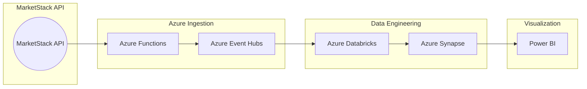

# 📈 Real-Time Apple Stock Streaming — Azure | Event Hub | Databricks | Synapse | Power BI

An enterprise-grade data engineering pipeline that captures **real-time Apple stock prices** using the **MarketStack API**, ingests the data through **Azure Event Hubs**, transforms it in **Azure Databricks**, and visualizes insights in **Power BI** via **Azure Synapse**.

---
## 📸 Power BI Dashboard Screenshot


## 💡 Project Overview

This end-to-end streaming solution:
- Ingests **Apple Inc. stock data** from MarketStack API
- Sends live data to **Azure Event Hub**
- Transforms and analyzes data in **Azure Databricks**
- Stores and queries data via **Azure Synapse Analytics**
- Visualizes KPIs and trends with **Power BI Dashboards**

---

## 📐 Architecture



---

## 🔍 MarketStack API Ingestion

Data is collected from MarketStack's REST API in JSON format, focusing on Apple (AAPL) stock:

```json
{
  "symbol": "AAPL",
  "date": "2024-12-01",
  "open": 190.5,
  "close": 193.2,
  "high": 194.1,
  "low": 189.7,
  "volume": 83012000
}
```

---

## ⚙️ Azure Function for Real-Time Ingestion

```python
import os, requests, json
from azure.eventhub import EventHubProducerClient, EventData

def main(mytimer: func.TimerRequest) -> None:
    api_url = "http://api.marketstack.com/v1/eod"
    params = {
        "access_key": os.environ["MARKETSTACK_API_KEY"],
        "symbols": "AAPL",
        "limit": 1
    }
    res = requests.get(api_url, params=params).json()
    data = res["data"][0]

    producer = EventHubProducerClient.from_connection_string(
        conn_str=os.environ["EVENT_HUB_CONN_STR"],
        eventhub_name="stock-stream"
    )
    batch = producer.create_batch()
    batch.add(EventData(json.dumps(data)))
    producer.send_batch(batch)
```

---

## 🔄 Databricks Transformation (PySpark)

```python
from pyspark.sql.functions import from_json, col
from pyspark.sql.types import *

schema = StructType([
    StructField("symbol", StringType()),
    StructField("date", StringType()),
    StructField("open", DoubleType()),
    StructField("close", DoubleType()),
    StructField("high", DoubleType()),
    StructField("low", DoubleType()),
    StructField("volume", IntegerType())
])

df = (spark.readStream
    .format("eventhubs")
    .option("eventhubs.connectionString", "<EVENT_HUB_CONN_STR>")
    .load()
    .selectExpr("cast(body as string) as json")
    .select(from_json(col("json"), schema).alias("data"))
    .select("data.*"))

df.writeStream.format("delta").outputMode("append").option("checkpointLocation", "/tmp/chk").start("/mnt/delta/apple_stock_data")
```

---

## 📊 Synapse & Power BI Integration

- Synapse reads the `delta` data as an external table.
- Power BI connects via DirectQuery to the Synapse view.
- Dashboards show live stock trends: open, close, high, low, and volume.

---

## 🔁 Real-Time Insights Use Cases

- Price drop alerts
- Volume surge monitoring
- Daily/weekly volatility tracking

---

## ✅ Setup Steps

1. Deploy Azure Function with MarketStack API integration
2. Connect Event Hub to Function App
3. Configure Databricks cluster & Delta Lake streaming
4. Create external tables/views in Synapse
5. Build Power BI dashboard from Synapse SQL endpoint

---

## 🔐 Security Practices

- Use Azure Key Vault for API keys & Event Hub secrets
- Enable logging/monitoring in Event Hub and Databricks
- Schedule cost alerts via Azure Cost Management

---

## 🤖 Why These Tools?

| Tool                | Why it’s used                                                                 |
|---------------------|--------------------------------------------------------------------------------|
| **Azure Functions** | Serverless trigger-based API ingestion                                        |
| **Azure Event Hubs**| Managed event streaming layer                                                 |
| **Databricks**      | Scalable, real-time Spark processing                                          |
| **Fabric (Kusto DB)**| Real-time telemetry storage and analysis                                      |
| **Power BI**        | Interactive analytics                                                         |
| **Data Activator**  | Rule-based automation on top of live data                                     |
| **Key Vault**       | Secure API keys and connection strings                                        |

---

## 🛡 License

MIT License. Use, modify, and deploy freely.
